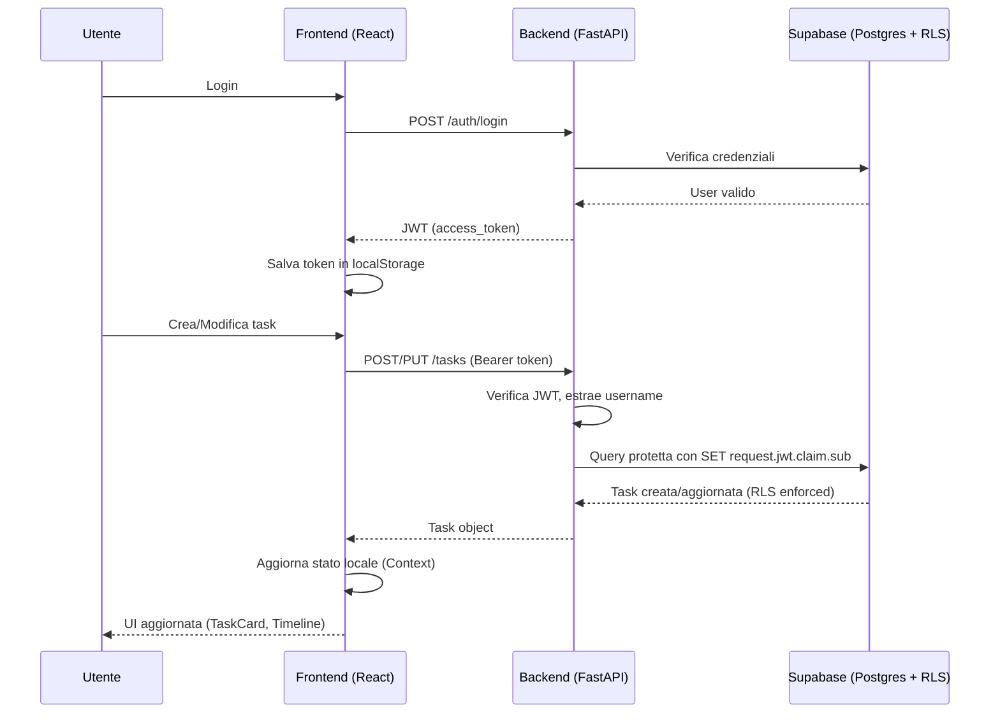

# My Planner – Frontend

Interfaccia React per **My Planner**, applicazione multi-tenant per la gestione delle attività con autenticazione JWT e Row-Level Security lato backend. Il frontend fornisce una dashboard interattiva con vista giornaliera, settimanale e mensile, composizione drag-friendly e CRUD completo delle task con campi avanzati (titolo, colore, durata/data fine).

---

## 🚀 Stack Tecnologico

| Tecnologia        | Ruolo                                                                    |
| ----------------- | ------------------------------------------------------------------------ |
| React 18 + Vite   | Rendering UI, build tool con HMR                                         |
| Tailwind CSS      | Styling utility-first e design system                                    |
| React Router v6   | Routing client-side                                                      |
| Axios             | HTTP client con interceptor JWT                                          |
| date-fns          | Formattazione e calcolo date (durate, intervalli, localizzazione IT)     |
| Lucide React      | Set di icone SVG                                                         |
| Context API       | Stato globale per autenticazione e tasks                                 |


---

## 🗂️ Struttura Progetto

```
src/
├── api/
│ ├── client.js # Axios instance con gestione token e baseURL
│ ├── auth.js # Chiamate /auth (login, register)
│ └── tasks.js # CRUD tasks: get, create, update, delete
├── components/
│ ├── TaskCard.jsx # Card singola task (titolo, descrizione, intervallo, azioni)
│ ├── TaskModal.jsx # Modal create/edit con scelta colore, durata o end-time
│ ├── DayView.jsx # Griglia giornaliera 0-23h
│ ├── WeekView.jsx # Planner settimanale 7 colonne
│ └── MonthView.jsx # Calendario mensile
├── contexts/
│ ├── AuthContext.jsx # Gestione sessione, token, login/logout
│ └── TaskContext.jsx # Stato tasks + CRUD + toggle completed
├── pages/
│ ├── AuthPage.jsx # Login / Registrazione
│ └── DashboardPage.jsx # Vista principale con layout e modale
├── App.jsx # Router + Provider (Protected Routes)
├── main.jsx # Entry point React
└── index.css # Tailwind base styles + custom utilities
```

---


---

## ✨ Funzionalità Chiave

- **Autenticazione JWT**
  - Login e registrazione con persistenza token in `localStorage`.
  - Interceptor Axios che allega `Authorization: Bearer <token>` e gestisce 401.
  - Protected Routes: redirect automatico al login se non autenticati.

- **Gestione Task Avanzata**
  - Campi: `title`, `description`, `color`, `date_time`, `end_time` *oppure* `duration_minutes`, `completed`.
  - Modal di creazione/modifica con:
    - Selettore colore (palette: green, purple, orange, cyan, pink, yellow).
    - Toggle fra durata (minuti) e data/ora di fine.
    - Validazioni front-end coerenti con Pydantic backend.
  - Card responsive con titolo, descrizione, intervallo calcolato (`date_time → end_time` o `date_time → date_time + duration`).
  - Azioni rapide: completa, modifica, elimina.
  - Sincronizzazione automatica con backend tramite Context API.

- **Dashboard Multi-Vista**
  - Viste Giorno/Settimana/Mese coordinate via Context.
  - Navigazione fra date, filtraggio locale, animazioni smooth.
  - Layout responsive mobile → desktop.

---

## 🔄 Flusso Dati



---

## 📦 Setup Locale

1. **Installazione dipendenze**
   ```bash
   npm install
   ```

2. **Variabili d'ambiente**
   
   **Sviluppo locale** - Crea `.env` nella root:
   ```env
   VITE_API_URL=http://localhost:8000
   ```
   
   **Produzione (Vercel)** - Imposta nelle variabili d'ambiente Vercel:
   ```env
   VITE_API_URL=https://your-backend-api.onrender.com
   ```

3. **Avvio sviluppo**
   ```bash
   npm run dev
   # Server disponibile su: http://localhost:3000
   ```

4. **Build produzione**
   ```bash
   npm run build
   npm run preview
   ```

---

## 🧪 Script npm

| Script          | Descrizione                                |
| --------------- | ------------------------------------------ |
| `npm run dev`   | Dev server Vite con HMR (porta 3000)       |
| `npm run build` | Build produzione (bundle + minify)         |
| `npm run preview` | Anteprima build ottimizzata              |

---

## 🎨 Tailwind CSS Configuration

Il progetto utilizza Tailwind con colori e classi custom definite in `tailwind.config.js`:

### Colori Custom
```javascript
{
  'planner-bg': '#F5F7FA',
  'planner-accent': '#6366F1',
  'planner-text': '#1F2937',
  'task-green': '#10B981',
  'task-purple': '#8B5CF6',
  'task-orange': '#F97316',
  'task-cyan': '#06B6D4',
  'task-pink': '#EC4899',
  'task-yellow': '#EAB308',
}
```

### Classi Utility Custom (in `index.css`)
- `btn-primary`: Pulsante principale con colore accent
- `btn-secondary`: Pulsante secondario grigio
- `input-field`: Input text/select con bordo e focus ring

---

## 🔧 Componenti e Schemi

### Task Payload (frontend ⇄ backend)

```json
{
  "title": "Sprint Review",
  "description": "Allineamento team",
  "color": "cyan",
  "date_time": "2025-01-15T09:00:00.000Z",
  "end_time": "2025-01-15T10:00:00.000Z",
  "duration_minutes": null,
  "completed": false
}
```

- `end_time` e `duration_minutes` sono **mutuamente esclusivi** (validato in frontend + backend).
- Quando `duration_minutes` è valorizzato, il frontend calcola l'orario di fine per visualizzazione usando `date-fns`.

### Context API Overview

| Context        | Stato                         | Azioni principali                         |
| -------------- | ----------------------------- | ----------------------------------------- |
| `AuthContext`  | `{ user, token, isAuthenticated, loading }` | `login()`, `register()`, `logout()`   |
| `TaskContext`  | `tasks[]`, `loading`, `error` | `fetchTasks()`, `addTask()`, `editTask()`, `removeTask()`, `toggleTaskComplete()` |

### Sincronizzazione Dati

- **Fetch automatico**: quando l'utente fa login, `TaskContext` carica automaticamente le task (`useEffect` triggered da `isAuthenticated`).
- **Optimistic UI**: le modifiche vengono applicate immediatamente allo stato locale e poi sincronizzate con il backend.
- **Gestione errori**: in caso di errore API, viene mostrato un alert e l'operazione viene annullata.

---

## 🔐 Sicurezza Frontend

- **Token JWT** conservato in `localStorage` con chiavi:
  - `access_token`: il JWT restituito dal backend
  - `username`: nome utente per visualizzazione
  
- **Interceptor Axios**:
  - **Request**: aggiunge automaticamente `Authorization: Bearer <token>` a ogni richiesta
  - **Response**: gestisce 401 rimuovendo il token e redirezionando al login
  
- **Protected Routes**:
  - Pattern implementato in `App.jsx` con componente `ProtectedRoute`
  - Se utente non autenticato → redirect automatico a `/` (login)
  - Se utente già autenticato e visita `/` → redirect a `/dashboard`
  - Stato di loading durante verifica token iniziale

---

## 📸 UI Highlights

- **TaskModal.jsx**
  - Stato locale gestito con `useState` per tutti i campi form.
  - `useEffect` per caricare i valori della task da modificare o resettare per nuova task.
  - Converte sempre gli input `datetime-local` in ISO string prima di inviare al backend.
  - Toggle radio button per scegliere tra `end_time` e `duration_minutes`.
  - Validazione client-side (tutti i campi obbligatori + coerenza durata).

- **TaskCard.jsx**
  - `formatTaskInterval()` calcola stringa orario con date-fns (`HH:mm → HH:mm` o con durata).
  - Applica classi dinamiche Tailwind per il colore selezionato (border + background).
  - Gruppo di pulsanti azione (Edit/Delete) visibili solo in hover (UX pulita).
  - Checkbox circolare per toggle completed con animazione.
  - Line-through su titolo/descrizione se task completata.

- **DayView / WeekView / MonthView**
  - Griglia temporale con slot orari.
  - Filtraggio task per data/intervallo.
  - Layout responsive con breakpoint Tailwind.

---

## 🐛 Troubleshooting

| Problema                        | Diagnostica rapida                                                  |
| ------------------------------ | ------------------------------------------------------------------- |
| Tasks non caricate             | Verificare `VITE_API_URL`, controllare token (`access_token`) nel `localStorage`.    |
| Errore CORS                    | Backend deve autorizzare l'origine frontend in `CORSMiddleware`.                        |
| Durata non salvata             | Assicurarsi che il toggle "Durata / Data fine" sia impostato correttamente e che venga passato `duration_minutes` come numero. |
| Token scaduto autoreload       | Interceptor Axios forza logout; rieseguire login.                   |
| Porta 3000 occupata            | Cambiare porta in `vite.config.js` (default cambiato da 5173 a 3000). |
| Build fallita                  | Verificare che tutte le dipendenze siano installate: `npm install`. |
| Redirect loop login            | Verificare che `ProtectedRoute` e `PublicRoute` funzionino correttamente. |

---

## 🌐 Deploy (Vercel)

### Prerequisiti
- Repository GitHub collegato a Vercel
- Backend FastAPI deployato e funzionante (es: Render)

### Configurazione

1. **Collega repository** a Vercel dashboard
2. **Imposta variabili d'ambiente**:
3. **npm install Preset**: Vite (rilevato automaticamente)
4. **Build Command**: `npm run build` (default)
5. **Output Directory**: `dist` (default)

### File vercel.json

Il file `vercel.json` nella root del progetto gestisce:
- Rewrites per supportare React Router (SPA routing)
- Headers CORS se necessario

**Esempio minimo**:
```json
{
  "rewrites": [{ "source": "/(.*)", "destination": "/index.html" }]
}
```

### Deploy Automatico
Ogni push su branch `main` triggera automaticamente un nuovo deploy.

---

## 🔄 Architettura Stato Globale

### AuthContext
```javascript
// Fornisce a tutta l'app:
{
  user: string | null,           // Username dell'utente autenticato
  isAuthenticated: boolean,      // true se c'è un token valido
  loading: boolean,              // true durante verifica iniziale token
  login(username, password),     // Funzione asincrona per login
  register(name_user, password), // Funzione asincrona per registrazione
  logout()                       // Rimuove token e resetta stato
}
```

### TaskContext
```javascript
// Fornisce gestione completa tasks:
{
  tasks: Task[],                 // Array di tutte le tasks
  loading: boolean,              // true durante fetch
  error: string | null,          // Messaggio errore (null se ok)
  fetchTasks(),                  // Ricarica tutte le tasks dal backend
  addTask(taskData),             // Crea nuova task
  editTask(taskId, taskData),    // Aggiorna task esistente
  removeTask(taskId),            // Elimina task
  toggleTaskComplete(taskId)     // Toggle campo completed
}
```

**Pattern di utilizzo**:
```jsx
import { useAuth } from './contexts/AuthContext';
import { useTasks } from './contexts/TaskContext';

function MyComponent() {
  const { user, logout } = useAuth();
  const { tasks, addTask, loading } = useTasks();
  
  // ... logica componente
}
```

---

## 📋 Roadmap / ToDo

- [ ] Drag & drop tra slot temporali (react-beautiful-dnd)
- [ ] Notifiche push per task imminenti (Service Worker + Push API)
- [ ] Accessibilità avanzata (focus trap modale, ARIA labels completi)
- [ ] Dark mode toggle (persistenza preferenza utente)
- [ ] Filtri avanzati (per colore, completate/non completate)
- [ ] Esportazione calendario (iCal format)
- [ ] Ricerca full-text nelle task
- [ ] Test E2E con Playwright o Cypress

---

## 🧪 Testing (Future)

Struttura consigliata per test:
```
tests/
├── unit/
│   ├── contexts/
│   │   ├── AuthContext.test.jsx
│   │   └── TaskContext.test.jsx
│   └── components/
│       ├── TaskCard.test.jsx
│       └── TaskModal.test.jsx
├── integration/
│   └── auth-flow.test.jsx
└── e2e/
    └── dashboard.spec.js
```

Framework consigliati:
- **Unit/Integration**: Vitest + React Testing Library
- **E2E**: Playwright o Cypress

---

## 📄 Licenza

Questo repository è parte della suite **My Planner** ed è rilasciato come open source (MIT License). Contributi e segnalazioni sono benvenuti!

---

## 🤝 Contribuire

1. Fork del repository
2. Crea branch per la feature (`git checkout -b feature/AmazingFeature`)
3. Commit delle modifiche (`git commit -m 'Add AmazingFeature'`)
4. Push al branch (`git push origin feature/AmazingFeature`)
5. Apri una Pull Request

Per bug o feature request, apri un'issue su GitHub.
```
